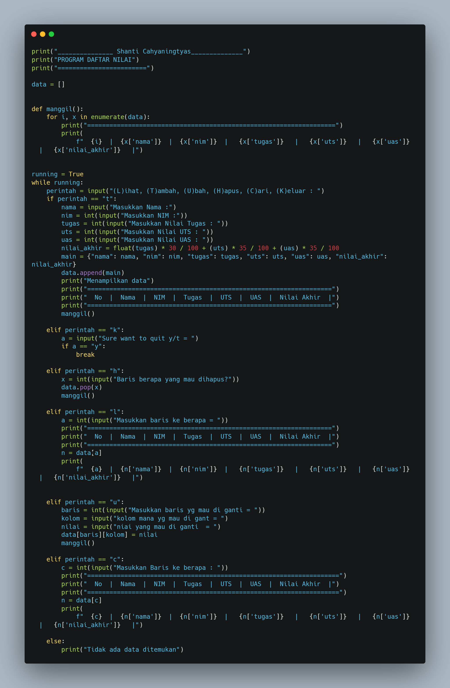
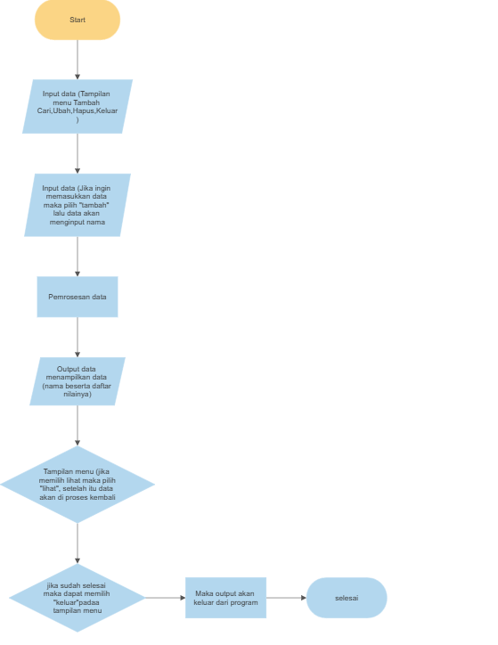

# Praktikum5

## Buat Program sederhana yang akan menampilkan daftar nilai mahasiswa
- Program di buat dengan menggunakan 'Dictionary'
- Tampilkan menu pilihan: (Tambah data,Ubah Data,Hapus Data, Tampilkan data,Cari data)
- Nilai Akhir di ambil dari perhitungan 3 komponen nilai (tugas:30%, uts: 35%, uas: 35%)
- Buatlah Flowchart 
- Commit dan Push Repository ke github

Untuk Menjalakan Program tersebut maka bisa di buat dengan cara seperti ini 

print("_______________ Shanti Cahyaningtyas______________")
print("PROGRAM DAFTAR NILAI")
print("========================")

data = []

def manggil():
    for i, x in enumerate(data):
        print("===================================================================")
        print(
            f"  {i}  |  {x['nama']}  |  {x['nim']}  |   {x['tugas']}   |   {x['uts']}   |   {x['uas']}   |   {x['nilai_akhir']}   |")

running = True
while running:
    perintah = input("(L)ihat, (T)ambah, (U)bah, (H)apus, (C)ari, (K)eluar : ")
    if perintah == "t":
        nama = input("Masukkan Nama :")
        nim = int(input("Masukkan NIM :"))
        tugas = int(input("Masukkan Nilai Tugas : "))
        uts = int(input("Masukkan Nilai UTS : "))
        uas = int(input("Masukkan Nilai UAS : "))
        nilai_akhir = float(tugas) * 30 / 100 + (uts) * 35 / 100 + (uas) * 35 / 100
        main = {"nama": nama, "nim": nim, "tugas": tugas, "uts": uts, "uas": uas, "nilai_akhir": nilai_akhir}
        data.append(main)
        print("Menampilkan data")
        print("==================================================================")
        print("  No  |  Nama  |  NIM  |  Tugas  |  UTS  |  UAS  |  Nilai Akhir  |")
        print("==================================================================")
        manggil()

    elif perintah == "k":
        a = input("Sure want to quit y/t = ")
        if a == "y":
            break

    elif perintah == "h":
        x = int(input("Baris berapa yang mau dihapus?"))
        data.pop(x)
        manggil()

    elif perintah == "l":
        a = int(input("Masukkan baris ke berapa = "))
        print("==================================================================")
        print("  No  |  Nama  |  NIM  |  Tugas  |  UTS  |  UAS  |  Nilai Akhir  |")
        print("==================================================================")
        n = data[a]
        print(
            f"  {a}  |  {n['nama']}  |  {n['nim']}  |   {n['tugas']}   |   {n['uts']}   |   {n['uas']}   |   {n['nilai_akhir']}   |")

    elif perintah == "u":
        baris = int(input("Masukkan baris yg mau di ganti = "))
        kolom = input("kolom mana yg mau di gant = ")
        nilai = input("niai yang mau di ganti  = ")
        data[baris][kolom] = nilai
        manggil()

    elif perintah == "c":
        c = int(input("Masukkan Baris ke berapa : "))
        print("====================================================================")
        print("  No  |  Nama  |  NIM  |  Tugas  |  UTS  |  UAS  |  Nilai Akhir  |")
        print("====================================================================")
        n = data[c]
        print(
            f"  {c}  |  {n['nama']}  |  {n['nim']}  |   {n['tugas']}   |   {n['uts']}   |   {n['uas']}   |   {n['nilai_akhir']}   |")

    else:
        print("Tidak ada data ditemukan")

# Flowchart 

Penjelasan Flowchart diatas
1. Mulai
2. Ditampilkan menu pilihan (Lihat, Ubah, Cari, Tambah, Hapus dan Keluar) user menginput salah satu pilihan untuk nantinya diproses
3. Ditampilkan kembali input an jika user memilih "tambah" berarti, user memasukkan input an (Nama, NIM, Nilai Tuags, UTS, UAS)
4. Data akan diproses seusai dengan yang user input
5. Menampilkan hasil output "Program Daftar Nilai"
6. Menampilkan keputusan unutk memilih kembali menu pilihan (Lihat, Ubah, Cari, Tambah, Hapus dan Keluar), jika memilih "lihat" maka user kembali memasukkan input an baris mana yang mau dicari, dan data akan diproses kembali kemudian menampilkan ulang "Program Daftar Nilai"
7. Menampilkan kembali keputusan menu pilihan (Lihat, Ubah, Cari, Tambah, Hapus dan Keluar), jika user memilih "keluar" maka lalu pilih "y" maka akan secara otomatis keluar dari program tersebut
8. Selesai

# Langkah - langkah 
1. Saya mengguanakan fungsi def untuk memanggil setiap proses menu, setiap kali dipanggil. Membuat index dari kolom ( No, Nama, NIM, Tugas, UTS, UAS, Nilai Akhir) dengan perulangan for dan memberikan nomor dengan enumarate.
2. Membuat input an menu pilihan: (Tambah Data, Ubah Data, Hapus Data, Tampilkan Data, Cari Data) mengguanakan statement if atau pilihan kondisi,
If perintah "t" yaitu tambah data, saya membuat input an memasukkan (Nama, NIM, Nilai Tugas, Nilai UTS, Nilai UAS) dan membuat rumus untuk nilai akhir nantinya.
 
3. kemudian saya membuat dict (main) yang berisi key itu semua dan menggabungkan dengan method append dan membuat tampilan kolom (N0, Nama, NIM, Tugas, UTS, UAS, Nilai Akhir) untuk memunculkan data mahasiswa.
4. Elif perintah "l" yaitu lihat, saya membuat input an integer mau lihat baris ke berapa?, dan membuat tampilan kolom (No, Nama, NIM, Tugas, UTS, UAS, Nilai Akhir) untuk memunculkan data mahasiswa. Dan memasukkan list inputan ke dalam data, terakhir membuat index untuk setiap posisi data.

5. Elif perintah "c" yaitu cari, saya membuat input an integer mau cari baris berapa?, sama seperti menu "lihat" saya membuat tampilan tampilan kolom (No, Nama, NIM, Tugas, UTS, UAS, Nilai Akhir) untuk memunculkan data mahasiswa. Dan memasukkan list inputan ke dalam data, terakhir membuat index untuk setiap posisi data.

6. Elif perintah "u" yaitu ubah, saya membuat input an variable x,y untuk menanyakan mau ubah baris ke berapa serta kolom berapa, dan input an nilai ganti untuk menanyakan nilai mana yang mau diganti?, kemudian memasukkan variable x,y menjadi list seperti data[x][y] = nilai

7. Elif perintah "h" yaitu hapus, saya membuat input an integer mau menghapus baris ke berapa?, dan memakai methods pop untuk menghapus data berdasarkan index/baris yang diinput. 

8.  Elif perintah "k" yaitu keluar,saya membuat variable inputan untuk menanyakan yakin untuk keluar?, if atau jika iya maka saya memakai fungsi break untuk jeda atau keluar dari program.

